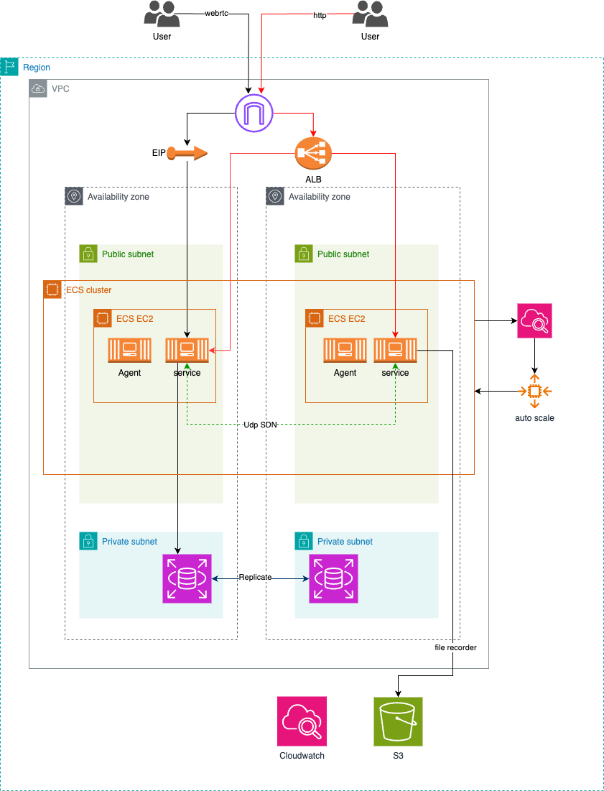

# A Terraform project to deploy 8xff media cloud

This is a project to deploy all system of 8xff cloud to AWS using terraform.

## Architecture Overview

Here is our architure in one region the cloud system.



## How it work

- Execute the following command to deploy

```bash
terraform init

terraform plan

terraform apply
```

## Roadmap

- [ ] single region

  - [x] console service
  - [x] media service
  - [x] connector service
  - [x] gateway service
  - [ ] sip gateway service
  - [ ] cloud panel
  - [ ] rds
  - [ ] autoscale
  - [ ] s3

- [ ] multi region
  - [ ] primary region
  - [ ] sub region
